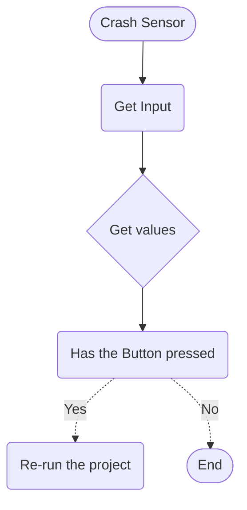
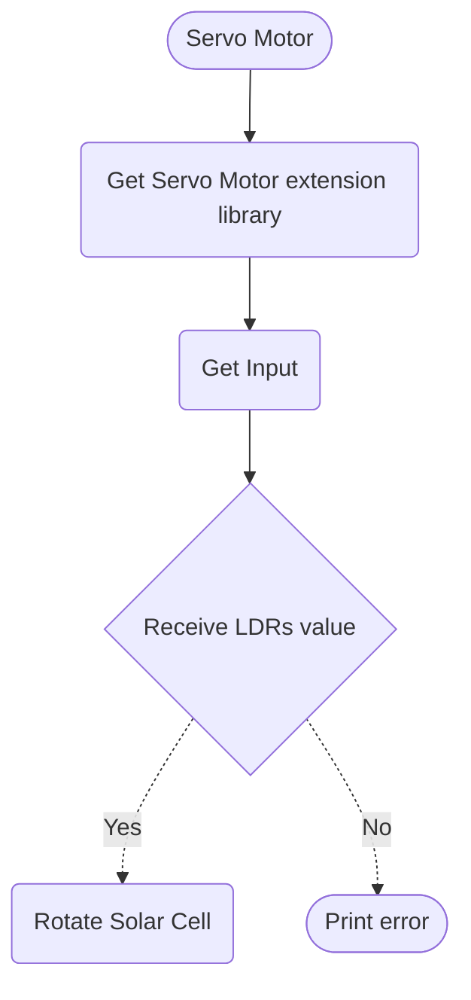

# Logic
> This is the Logic for each items in the Smart Solar Tracker Project.

## CrashSensor


## Servo Motor


## LDRs
```mermaid
flowchart TD
%% Comment
    Start([LDRs])
    InputLDR1(Get east LDR Input)
    InputLDR2(Get west LDR Input)
    GetValues{Get values}
    CheckForLightLevels(Check for observable light levels area)
    SentValueToServoMotor(Sent the value to Servo Motor)
    PrintOutError([Print error])


    Start --> InputLDR1 --> GetValues
    Start --> InputLDR2 --> GetValues
    
    GetValues --> CheckForLightLevels

    CheckForLightLevels -.-> |Detected| SentValueToServoMotor
    CheckForLightLevels -.-> |Undetected| PrintOutError