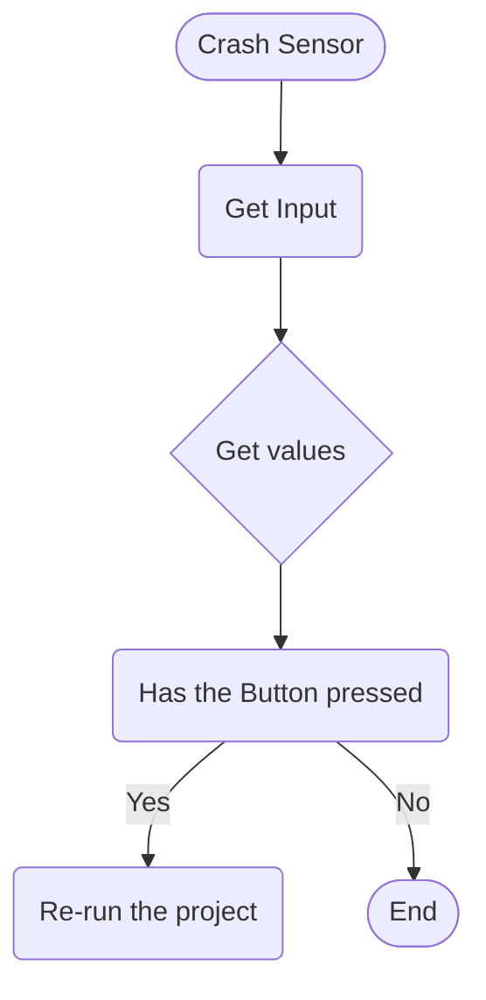
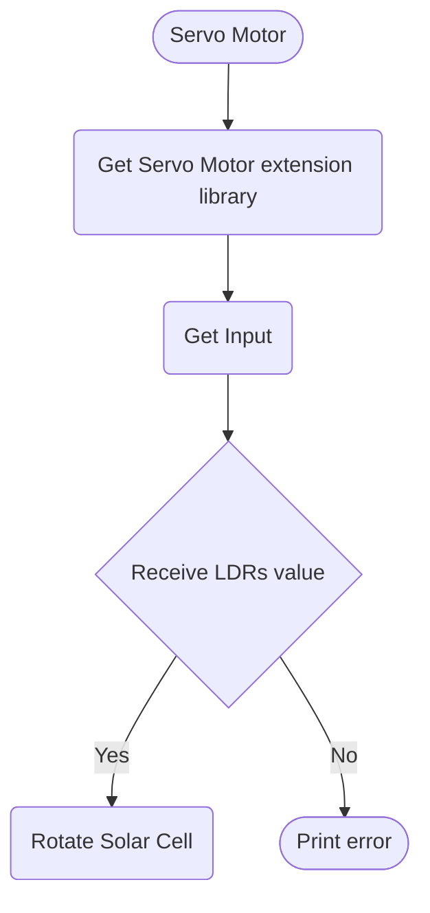

# Logic
> This is the Logic for each items in the Smart Solar Tracker Project.

## CrashSensor


## Servo Motor


## LDRs
```mermaid
flowchart TD
    Start([LDRs])
    InputLDR1(Get east LDR Input)
    InputLDR2(Get west LDR Input)
    GetLDR1Values{Get values}
    GetLDR2Values{Get values}
    CheckForLightLevels(Check for observable light levels area)
    SentValueToServoMotor(Sent the value to Servo Motor)
    PrintOutError([Print error])


    Start --> InputLDR1 --> GetLDR1Values --> CheckForLightLevels 
    Start --> InputLDR2 --> GetLDR2Values --> CheckForLightLevels
    
    CheckForLightLevels --> |Detected| SentValueToServoMotor
    CheckForLightLevels --> |Undetected| PrintOutError