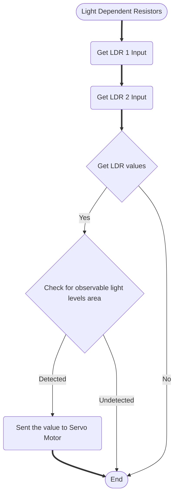
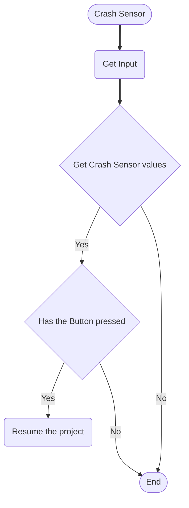
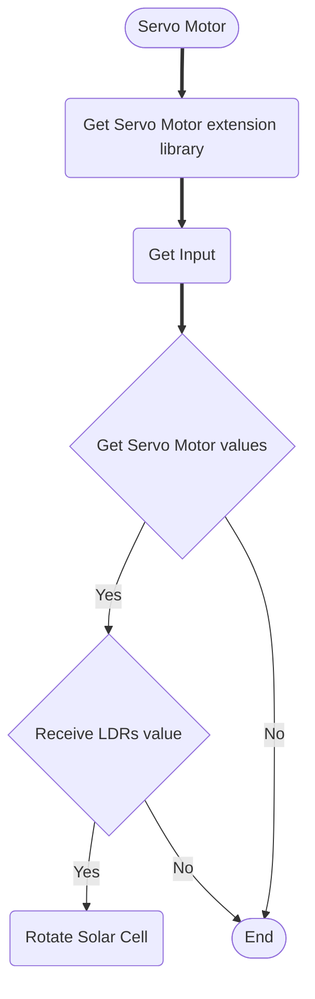

# Logic
> This is the Logic for each items in the Smart Solar Tracker Project.

## LDRs

```mermaid
flowchart TD
%% Comment
    Start([Light Dependent Resistors])
    InputLDR1(Get LDR 1 Input)
    InputLDR2(Get LDR 2 Input)
    GetLDRValues{Get LDR values}
    CheckForLightLevels{Check for observable light levels area}
    SentValueToServoMotor(Sent the value to Servo Motor)
    End([End])


    Start ==> InputLDR1 ==> InputLDR2 ==> GetLDRValues
    SentValueToServoMotor ==> End

    CheckForLightLevels ---> |Detected| SentValueToServoMotor
    CheckForLightLevels --> |Undetected| End

    GetLDRValues --> |No| End
    GetLDRValues --> |Yes| CheckForLightLevels
```

## CrashSensor

```mermaid
flowchart TD
%% Comment
    Start([Crash Sensor])
    InputCrashSensor(Get Input)
    GetCrashSensorValue{Get Crash Sensor values}
    CheckButton{Has the Button pressed}
    Activate(Resume the project)
    End([End])

    Start ==> InputCrashSensor ==> GetCrashSensorValue

    CheckButton --> |Yes| Activate
    CheckButton ---> |No| End

    GetCrashSensorValue --> |No| End
    GetCrashSensorValue --> |Yes| CheckButton
``` 

## Servo Motor

```mermaid
flowchart TD
%% Comment
    Start([Servo Motor])
    GetServoMotorExtensionLibrary(Get Servo Motor extension library)
    InputServoMotor(Get Input)
    GetServoMotorValues{Get Servo Motor values}
    ReceiveLDRsValue{Receive LDRs value}
    SpinTheSolarCell(Rotate Solar Cell)
    End([End])

    Start ==> GetServoMotorExtensionLibrary ==> InputServoMotor ==> GetServoMotorValues
    
    ReceiveLDRsValue --> |Yes| SpinTheSolarCell
    ReceiveLDRsValue --> |No| End

    GetServoMotorValues --> |Yes| ReceiveLDRsValue
    GetServoMotorValues --> |No| End
```